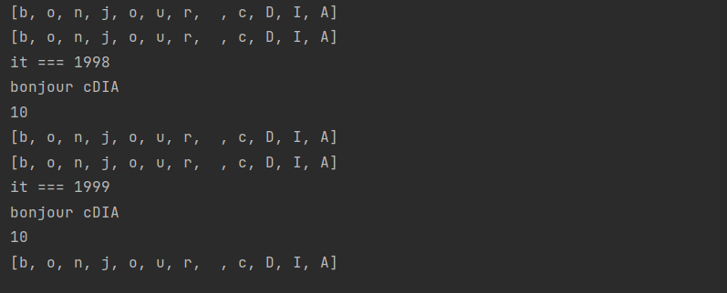

# tp_sma_algorithme_genetique

Le travail concernant l'implémentation de l'algorithme génétique avec les islands se trouve dans le packages ma.enset.ga_string_sma

L'algorithme génétique avec les îles, également connu sous le nom d'algorithme génétique parallèle, est une variante de l'algorithme génétique classique qui vise à améliorer les performances et la diversité des solutions.

Dans un algorithme génétique traditionnel, une seule population d'individus évolue au fil des générations pour trouver la meilleure solution possible. Cependant, cette approche peut parfois entraîner une convergence prématurée vers un optimum local, limitant ainsi l'exploration de l'espace des solutions.

L'idée principale derrière l'algorithme génétique avec les îles est de créer plusieurs sous-populations indépendantes, appelées "îles", qui évoluent simultanément. Chaque île a sa propre population d'individus et effectue des opérations génétiques (sélection, croisement, mutation) de manière autonome.

Périodiquement, des individus sélectionnés parmi les meilleures solutions de chaque île sont échangés avec d'autres îles. Cela permet de transférer des informations génétiques entre les îles, favorisant ainsi l'exploration de différentes régions de l'espace des solutions.

# Implémentation de l'algorithme

Pour l'implémentation de l'algorithme nous avons crée 2 agents principales :
  ## L'agent Island
  
  Dans cette agent nous initialisons une population, puis on passe on trie en fonction du fitness pour choisir les meilleur individus. Ensuite on passe à la selections des deux meilleurs individus, puis à leur croisement et enfin à la mutation de quelques. On repète cette opération plusieurs fois jusqu'à atteindre le nombre maximum d'itérations ou le fitness maximum.
  
  
  
  Ensuite on envoie le meilleurs individus à l'agent master
  
  
  
  ## L'agent Master
  
  L'agent Master recoit le message du meilleurs individus de l'agent Island, de son fitness et de l'AID de l'agent qui a envoyé le message. Il l'ajoute ensuite dans une liste d'individualsAID( une classe qui a été crée). Enfin il passe au trie pour afficher le meilleur individu, son fitness et l'agent qui lui a trouvé.
  
  
  
  # Resultat de l'implémentation
  
  Pour l'implémentation nous avons lancé 7 Island Agent
  
  ## Island Agent 
  
  
  ## Island 1 Agent
  
  
   ## Island 2 Agent
   
  
  
   ## Island 3 Agent
  
  
   ## Island 4 Agent
  
  
   ## Island 5 Agent
  
  
   ## Island 6 Agent
  
  
  
  ## Apercu de l'agent Master
  
  On remarque bien que que c'est l'agent Island 2 qui a le meilleur individu avec une fitness de 11
  
  
  
